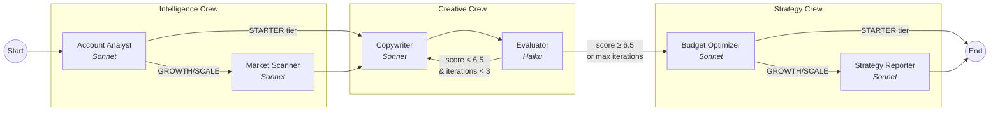

# AdWing.ai

**Multi-agent advertising automation system that replaces the workflow of a human media buyer.**

[](https://adwing.vercel.app)
[](https://github.com/serena/adwing/actions/workflows/ci.yml)


---

## Architecture

Three AI agent crews orchestrated by LangGraph.js into a stateful pipeline with conditional routing and a reflexion loop:



### Data Flow

Each crew reads upstream data from LangGraph shared state and writes its output, making it immediately available to downstream crews:

```
Intelligence Crew → accountHealth, competitorInsight
Creative Crew     → adCopyBatch (scored variants), creativeIterations
Strategy Crew     → budgetRecommendation, strategyReport
```

---

## Tech Stack & Rationale

| Technology | Why This Choice |
|-----------|----------------|
| **LangGraph.js** | Need stateful conditional routing + cyclic graphs (reflexion loop). A simple LangChain chain can't do loops or tier-based edge skipping. |
| **Claude Sonnet (generation) + Haiku (evaluation)** | Evaluator doesn't need a frontier model — Haiku is ~10x cheaper per token. Sonnet handles nuanced creative generation. |
| **Next.js 15 (App Router)** | Full-stack in one codebase: React frontend + API routes + server components. |
| **Prisma + SQLite (dev) / PostgreSQL (prod)** | Zero-config local dev with SQLite. One line change in `schema.prisma` to switch to Postgres. |
| **Zod schemas** | Runtime validation of LLM JSON output — LLMs don't always return valid schemas. Six schemas validate every agent response. |
| **BullMQ + Redis** | Background job processing for weekly strategy cycles. Agents can take 30-60s; can't block HTTP requests. |

---

## Quick Start

```bash
# Install dependencies
npm install

# Generate Prisma client + seed SQLite database
npx prisma generate && npx prisma db push

# Start dev server (demo mode — no API key needed)
npm run dev
```

Open [http://localhost:3000](http://localhost:3000). The dashboard runs in **demo mode** with mock data when `ANTHROPIC_API_KEY` is not set. Click "Run" on any agent crew to see sample results.

Or visit the **[live demo on Vercel](https://adwing.vercel.app)** — runs in demo mode with no setup required.

To run with live AI agents:
```bash
echo "ANTHROPIC_API_KEY=sk-ant-..." > .env
npm run dev
```

---

## Business Context

### Market Reality

I researched 20+ ad automation products before building this. The market is more crowded than I initially assumed:

| Competitor | What They Do | Threat Level |
|-----------|-------------|-------------|
| **Madgicx** | Already brands as "Agentic AI." AI Marketer + AI Ad Generator + AI Bidding. Meta/Google/TikTok. $99+/mo. | Very High |
| **AdScale** | Shopify App Store 4.7★ (454 reviews). AI creative + cross-channel budget optimization. $99-$197/mo. | Very High |
| **Zocket** | Multi-AI modules across Meta/Google/TikTok/Snapchat. Shopify native. | Very High |
| **Shopify Built-in** | Winter '26 launch: upload assets → AI generates hundreds of ad variants. 4.6M+ stores, zero CAC. | Structural |

**Honest assessment:** There is no moat at the feature level. Madgicx, AdScale, and Zocket already cover most of the same capabilities at the same price point ($99/mo).

### Where Differentiation Would Lie

1. **Advisor experience vs. tool experience** — AI media buyer that tells you what to do, not a dashboard you have to figure out
2. **Intelligence → Creative closed loop** — Competitor insights directly drive copy generation (most tools keep these separate)
3. **Provable AI reasoning quality** — Would need to be proven with A/B test data, not claimed

---

## Why I Built This

I wanted to explore a non-trivial multi-agent system — one where agents have genuine interdependencies, not just sequential calls. The advertising domain provided natural complexity:

- **Conditional routing**: Different subscription tiers skip different pipeline stages
- **Cyclic graphs**: The reflexion loop (Copywriter ↔ Evaluator) can't be modeled as a DAG
- **Heterogeneous models**: Generation tasks need a capable model; evaluation tasks don't
- **Shared state coordination**: 6 agents reading/writing to typed state channels with reducers

This is the kind of orchestration problem where LangGraph adds real value over a simple chain.

---

## What I'd Do Differently

1. **Validate demand before building** — I built a full product before doing competitive research. Should have done 20 customer interviews first. The market turned out to be saturated.

2. **Use structured output instead of JSON-in-prompt** — Every agent parses `response.content` as raw JSON text. Claude's tool use / structured output would eliminate the JSON extraction + `try/catch` pattern repeated across all 6 agents.

3. **Empirically tune the quality threshold** — The `QUALITY_THRESHOLD = 6.5` and `MAX_ITERATIONS = 3` in the evaluator are educated guesses. Should be calibrated against human evaluations with a labeled dataset.

4. **Extract the response parsing pattern** — All 6 agent nodes repeat identical `response.content` extraction logic. Should be a shared utility.

---

## If Continuing Development

- **Execution Crew** — Currently the pipeline stops at recommendations. The natural next step is a Campaign Builder agent that actually creates campaigns via Meta/Google APIs, with human approval gates.
- **Streaming progress** — Agent runs take 30-60s. Real-time streaming of intermediate results (e.g., "Intelligence complete, starting Creative...") would dramatically improve UX.
- **Cross-user knowledge base** — "Brands in the skincare niche see 23% higher CTR with UGC-style hooks" — aggregated learnings that make the system smarter over time.
- **Structured output migration** — Replace JSON-in-prompt with Claude's native tool use for guaranteed schema compliance.

---

## Storybook

Component library with 15+ stories covering UI primitives and domain-specific compositions:

```bash
npm run storybook
```

Stories include:
- **UI Primitives** — Button (6 variants + loading), Badge (6 variants + agent crew)
- **Dashboard Cards** — Health score, spend metrics, ROAS, ad copy count
- **Agent Crew Runner** — Intelligence / Creative / Strategy / Full Pipeline cards
- **Ad Copy Variant** — Generated ad with quality score, reflexion testing notes, approve/reject
- **Budget Reallocation** — Current vs recommended spend with % change
- **Competitor Intelligence** — Tracked ads, estimated spend, top hooks
- **Alerts & Opportunities** — Critical / warning / info anomaly cards
- **Onboarding Flow** — Multi-step ad account connection wizard
- **Demo Mode Banner** — Conditional UI when API key is not set

---

## Project Structure

```
src/
├── agents/
│   ├── graph.ts              # LangGraph pipeline definition + routing
│   ├── state.ts              # Shared state (Annotation channels + reducers)
│   ├── llm.ts                # Model configuration (Sonnet + Haiku)
│   ├── mock-data.ts          # Demo mode data
│   ├── intelligence/
│   │   ├── account-analyst.ts
│   │   └── market-scanner.ts
│   ├── creative/
│   │   ├── copywriter.ts     # Sonnet — generates ad copy variants
│   │   └── evaluator.ts      # Haiku — LLM-as-Judge reflexion
│   └── strategy/
│       ├── budget-optimizer.ts
│       └── strategy-reporter.ts
├── app/
│   ├── api/agents/           # REST endpoints per crew
│   ├── dashboard/            # Main UI pages
│   └── onboarding/
├── lib/                      # Auth, DB, utilities
├── types/                    # Zod schemas + TypeScript types
└── integrations/             # Shopify, Meta, Google API clients
```

---

## License

MIT
